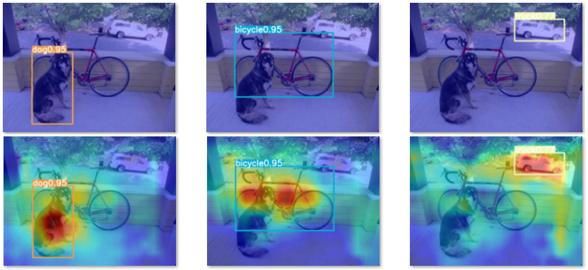
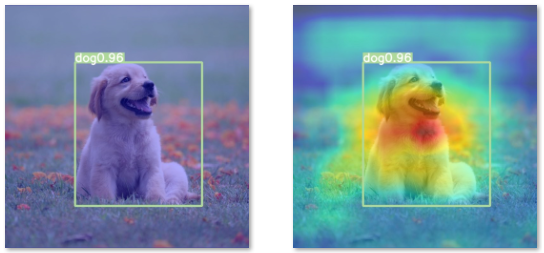

# GradCAM_YOLOv7
* Everyone knows the YOLO series model always can get good performance on detection tasks.
* I want to know does YOLO really learns the feature information or not.
* I will find time to add the code description

## YOLO series model
* I already prepared and published the technique description on the internet. [[HERE]](https://ithelp.ithome.com.tw/users/20120310/ironman/6372)
* One-stage methods prioritize inference speed, and models include YOLO, SSD, and RetinaNet.
* You can also refer to this website I wrote for how to train the YOLO model. [[HERE]](https://ithelp.ithome.com.tw/users/20120310/ironman/6372)

## GradCAM
* Explainable AI for computer vision. This can be used for diagnosing model predictions, either in production or while developing models.
* Weight the 2D activations by the average gradient.

## YOLOv7 origin code needs to modify
1. ./model/yolo.py
2. ./model/experimental.py

## Additional codes
1. ./model/gradcam.py
2. ./model/yolov7_object_detector.py
3. main_gradcam.py

## Results

